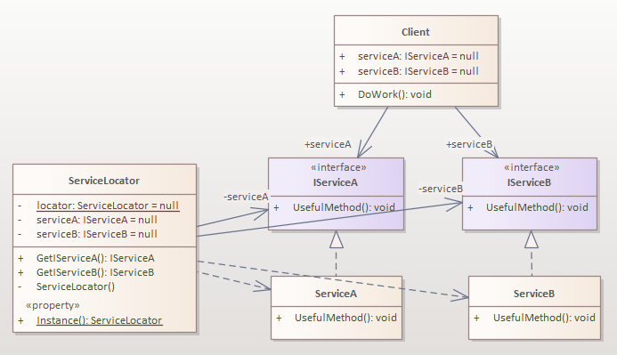
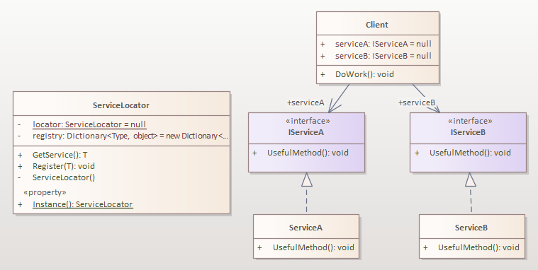

<h1 align="center">Service Locator Pattern</h1>

The **Service Locator** pattern is a creational pattern that provides a centralized registry or container for obtaining references to various services or dependencies within an application. It separates the responsibility of locating and providing services from the client objects that require those services.

## Problem
The main problems the Service Locator pattern attempts to solve are:

- Dependency Management: In complex applications, components often depend on other services or dependencies. Managing these dependencies manually can become challenging and error-prone. The Service Locator pattern provides a centralized mechanism for managing and resolving dependencies, removing the need for explicit dependency management in each component.

- Decoupling: Components should ideally be decoupled from the specific implementations of the services they depend on. By using the Service Locator pattern, components can request dependencies through the service locator interface, without needing to know the concrete classes or implementations behind them. This promotes loose coupling, as components only depend on abstractions rather than concrete implementations.

- Runtime Dependency Resolution: The Service Locator pattern allows dependencies to be resolved at runtime, as opposed to compile-time. This flexibility is useful in scenarios where the dependencies may change or need to be dynamically determined based on certain conditions or configurations.

- Code Reusability: The Service Locator pattern promotes code reusability by providing a centralized location for registering and accessing services. Multiple components can share the same service instances, reducing the need for duplication and improving overall code maintainability.

## Structure

- The **Client** is a component/class that wants to use services provided by another component, called **Service**.

- The **Service interface** is an abstraction describing what kind of services Service component is providing.

- The **Service** component/class is providing services according to Service-Interface description.

- The **Service Locator** Is a component/class that encapsulates knowledge of how to obtain services that the **Client** needs/depend upon. It is a single point of contact for the **Client** to get services. It is a singleton registry for all services that are used by the client. The `ServiceLocator` is responsible for returning instances of services when they are requested by the **Client**.

### Service Locator Pattern Structure (Static Implementation)

This version of the pattern is called the **static version** because it uses a field for each service to store an object reference and has a dedicated `Get` method name for each type of service it provides. It is not possible to dynamically add a different type of service to the `ServiceLocator`. Everything is statically hardcoded.

### Service Locator Pattern Structure (Dynamic Implementation Using String Service Names)

Here, we will show a **dynamic version** of this pattern, a version with **strings used as Service names**. The principles are the same as above, just the implementation of `ServiceLocator` is different.

- Please note that in this version, we have an **initialization phase** in which we register services with `ServiceLocator`. That can be done from code dynamically, or from a configuration file.

### Service Locator Pattern Structure (Dynamic Implementation Using Generics)

Here, we will show another **dynamic version** of this pattern, a version based on **generics methods**. The principles are the same as above, just the implementation of `ServiceLocator` is different. 

- Please note that again in this version, we have an **initialization phase** in which we register services with `ServiceLocator`. That can be done from code dynamically, or from a configuration file.

### There are Different Implementations like:
- Service Locator with Lazy Initialization
- Hierarchical Service Locator
- Scoped Service Locator

## Note: 
- See The attached code examples (SLP Different Implementations Project) for each implementation above.

- See The attached code examples (Service Locator Pattern project) Where I used Service Locator Pattern instead of Factory Pattern to apply IoC principle.

## Service Locator is Considered an Anti-Pattern

- The ***anti-pattern*** is a commonly-used structure or pattern that, despite initially appearing to be an appropriate and effective response to a problem, has more bad consequences than good ones

The ***Service Locator pattern*** is considered an ***anti-pattern*** in modern software engineering practices due to several drawbacks and potential issues it can introduce. Here are some reasons why it is considered an ***anti-pattern***:

- Hidden Dependencies: With the Service Locator pattern, the dependencies of client objects are hidden, as they don't explicitly declare their dependencies in their constructors or method parameters. This can make the code harder to understand and reason about, as the dependencies are not clearly visible.

- Decreased Testability: The Service Locator pattern can hinder the testability of client objects. In unit testing, it becomes difficult to isolate client objects and provide specific dependencies for testing, as the dependencies are resolved through the Service Locator. This can lead to more complex and fragile test setups.

- Hidden Coupling: The Service Locator pattern introduces hidden coupling between client objects and the Service Locator itself. Client objects need to be aware of and depend on the Service Locator to obtain their dependencies. This can make the codebase more difficult to maintain and refactor, as changes to the Service Locator interface or implementation may require modifications in multiple client objects.

- Global State and Runtime Configuration Issues: The Service Locator pattern can lead to the creation of a global state, as the Service Locator acts as a shared registry for services. This can make it challenging to reason about the state and behavior of the application. Additionally, runtime configuration of services through the Service Locator can make the code harder to understand and debug, as the dependencies can change dynamically during the application lifecycle.

Due to these reasons, the Service Locator pattern is often discouraged in favor of more explicit and decoupled dependency injection patterns, such as constructor injection or method injection, which promote better testability, maintainability, and code clarity.

## Pros
- It supports the run time binding and adding components at runtime.

- At runtime, components can be replaced, for example, `ServiceA` with `ServiceA2`, without restarting the application.

- It enables replacing modules at will, due to the DIP principle and separation of modules by interfaces.

## Cons
- The `Client` has an additional dependency on `ServiceLocator`. It is not possible to reuse `Client` code without the `ServiceLocator`.

- The `ServiceLocator` obscures the `Client` dependencies, causing run-time errors instead of compile-time errors when dependencies are missing.

- All components need to have a reference to the service locator, which is a singleton.

- Implementing the service locator as a singleton can also create scalability problems in highly concurrent environments.

- Testability problems might arise since all tests need to use the same global `ServiceLocator` (singleton).

- During unit testing, you need to mock both the `ServiceLocator` and the services it locates.