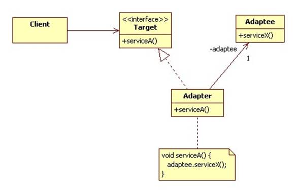
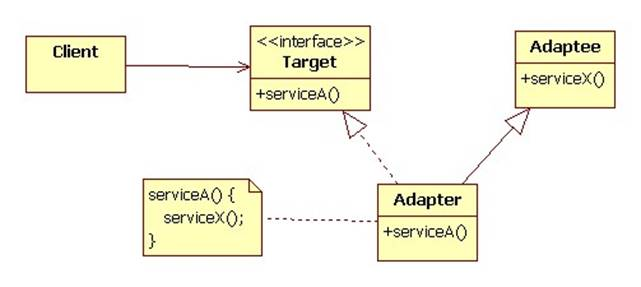

# Adapter Design Pattern
Adapter is a structural design pattern that allows objects with incompatible interfaces to collaborate.

## Problem
The key problem the adapter pattern seeks to address is incompatible interfaces. You have some client code that needs to use one or more service providers, and the interface the client is set up to call doesn't match the one the service provider defines.

## Solution
Adapters convert the interface of one class into an interface a client expects. That's it. That's their whole reason for existence. In software, adapters are sometimes referred to as wrappers because they wrap an incompatible object in a compatible one.

## Two Kinds of Adapters
### Object Adapter 
This implementation uses the composition principle: the adapter implements the interface of one object and wraps the other one. It can be implemented in all popular programming languages.

We can introduce new types of adapters into the program without breaking the existing client code.
This can be useful when the interface of the service class gets changed or replaced: you can just create a new adapter class without changing the client code.

### Class Adapter 
This implementation uses inheritance: the adapter inherits interfaces from both objects at the same time. Note that this approach can only be implemented in programming languages that support multiple inheritance, such as C++.

The Class Adapter doesn’t need to wrap any objects because it inherits behaviors from both the client and the service.
The adaptation happens within the overridden methods. The resulting adapter can be used in place of an existing client class.

## Pros
Single Responsibility Principle. You can separate the interface or data conversion code from the primary business logic of the program.

Open/Closed Principle. You can introduce new types of adapters into the program without breaking the existing client code, as long as they work with the adapters through the client interface.

## Cons
The overall complexity of the code increases because you need to introduce a set of new interfaces and classes. Sometimes it’s simpler just to change the service class so that it matches the rest of your code.

## Relations with Other Patterns
- **Bridge** is usually designed up-front, letting you develop parts of an application independently of each other. On the other hand, **Adapter** is commonly used with an existing app to make some otherwise-incompatible classes work together nicely.
- **Adapter** changes the interface of an existing object, while **Decorator** enhances an object without changing its interface. In addition, **Decorator** supports recursive composition, which isn’t possible when you use Adapter.
- **Adapter** provides a different interface to the wrapped object, **Proxy** provides it with the same interface, and **Decorator** provides it with an enhanced interface.
- **Facade** defines a new interface for existing objects, whereas **Adapter** tries to make the existing interface usable. Adapter usually wraps just one object, while Facade works with an entire subsystem of objects.
- Sometimes the **Repository** pattern acts as an **Adapter**, providing a common interface for persistence that can map various incompatible interfaces to a single common data access strategy.
- **Bridge, State, Strategy** (and to some degree **Adapter**) have very similar structures. Indeed, all of these patterns are based on composition, which is delegating work to other objects. However, they all solve different problems. A pattern isn’t just a recipe for structuring your code in a specific way. It can also communicate to other developers the problem the pattern solves.