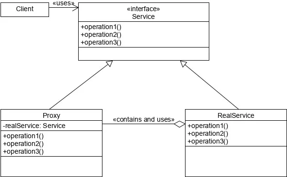
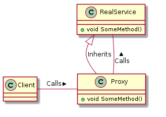

# Proxy Design Pattern
**Proxy** is a structural design pattern that lets you provide a substitute or placeholder for another object. A proxy controls
access to the original object, allowing you to perform something either before or after the request gets through to the original object.

## Problem
you need to control access to a type for performance, security, or other reasons. The proxy design pattern is all about controlling access to another instance.

## Solution
The Proxy pattern suggests that you create a new proxy class with the same interface as an original service object. Then you update your app so that it passes the proxy object to all of the original object’s clients. Upon receiving a request from a client, the proxy creates a real service object and delegates all the work to it.
But what’s the benefit? If you need to execute something either before or after the primary logic of the class, the proxy lets you do this without changing that class. Since the proxy implements the same interface as the original class, it can be passed to any client that expects a real service object.

## Structure

- The **Service Interface** declares the interface of the Service. The proxy must follow this interface to be able to disguise itself as a service object.
- The **Service** is a class that provides some useful business logic.
- The **Proxy** class has a reference field that points to a service object. After the proxy finishes its processing (e.g., lazy initialization, logging, access control, caching, etc.), it passes the request to the service object. Usually, proxies manage the full lifecycle of their service objects.
- The **Client** should work with both services and proxies via the same interface. This way you can pass a proxy into any code that expects a service object.
 

 

An alternative structure for using the **proxy** has the proxy **inherit** from the **RealService**. This approach still leverages polymorphism, and the client will still have a dependency on the RealService, but instead will get the proxy. However, this approach is less desirable because it is a less flexible design. It is a bit simpler, and it will work in many scenarios, especially if you don't have the ability to modify RealService so that it inherits from a new common interface, or base type. However, this approach does require that RealService has marked any necessary methods or properties that you're going to use as virtual, so that the proxy can override them.

## Proxy Variants
### Virtual Proxy (Lazy initialization)
This is when you have a heavyweight service object that wastes system resources by being always up, even though you only need it from time to time.

Instead of creating the object when the app launches, you can delay the object’s initialization to a time when it’s really
needed.

### Remote Proxy (Local execution of a remote service)
This is when the service object is located on a remote server. In this case, the proxy passes the client request over the network, handling all of the nasty details of working with the network.

### Smart Proxy
A smart proxy is used to add additional logic around access to a resource. These can be useful to perform resource counting, or to manage the caching of a resource, logging, or to lock access to shared resources

### Protection Proxy (Access Control)
which controls access to a sensitive resource by checking for whether or not the client is authorized to perform those operations.

## Pros
- You can control the service object without clients knowing about it.
- You can manage the lifecycle of the service object when clients don’t care about it.
- The proxy works even if the service object isn’t ready or is not available.
- **Open/Closed Principle**. You can introduce new proxies without changing the service or clients.

## Cons
- The code may become more complicated since you need to introduce a lot of new classes.
- The response from the service might get delayed.