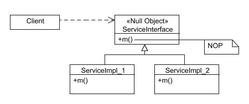

<h1 align="center">Null Object Pattern</h1>

**The Null Object Pattern** intents to reduce the need to add checks and special behavior for handling ***null*** instances of certain variables that tend to propagate through applications.

## Problem
For instance, consider a call center application that looks up customers based on their phone number:

```
public Customer GetByPhoneNumber(string phoneNumber) =>
  _customerRepository.List(c => c.PhoneNumber == phoneNumber).FirstOrDefault();
```

Now imagine that elsewhere the application needs to display some details about the customer that was found, such as their total number of orders and amount spent. The application will need to be careful to check for null:

```
var customer = GetByPhoneNumber(phone);

int orderCount = customer != null ? customer.OrderCount : 0;
decimal totalPurchase = customer != null ? customer.TotalPurchase : 0m;
```

This kind of code gets even more verbose if full if blocks are used, and it's very easy to miss a check, in which case a runtime null reference exception is likely.

## Solution

the Null Object Pattern can be implemented to provide a non-null object that behaves as a substitute for a null reference, allowing the code to safely call methods or access properties without explicitly checking for null.

To implement the Null Object Pattern, an instance of Customer is created to represent the case of a "*not found*" customer:

```
public class Customer
{
  public static Customer NotFound = new Customer() { OrderCount=0, TotalSales=0m };
}
```

Another way implement the Null Object Pattern, is by using inheritance:

```
Copy
public class NullObjectCustomer : Customer
{
  public NullObjectCustomer() {
    OrderCount=0;
    TotalSales=0m;
  }
}
```

Then, wherever you would have a method that could return a null Customer, have it return the static instance instead:

```
public Customer GetByPhoneNumber(string phoneNumber)
{
    var customer = _customerRepository.List(c => c.PhoneNumber == phoneNumber).FirstOrDefault();
    if(customer is null)
        return Customer.NotFound; 
    return customer;
}
```

If using `NullObjectCustomer`, code is the same, except for:

```
return new NullObjectCustomer();
```

## Structure
<p align="center"></p>

- **Abstract Base Class or Interface**: This component defines the common contract or interface that both the real object and the null object will adhere to. It specifies the methods and properties that the client code can use to interact with the objects.

- **Real Object Class**: This class represents the actual implementation of the desired object. It inherits from the abstract base class or implements the interface defined in the first component. It provides the intended behavior and functionality that the client code expects.

- **Null Object Class**: This class serves as a substitute for the real object when a null reference is encountered. It also inherits from the abstract base class or implements the interface defined in the first component. It provides a default or empty implementation of the methods and properties defined in the contract, mimicking the behavior of the real object.

- **Client Code**: This is the code that interacts with the objects using the abstract base class or interface. It does not need to perform explicit null checks because the null object class provides a valid substitute with default behavior. The client code remains unaware whether it is working with the real object or the null object.

## Pros
- Avoids Null Reference Exceptions: By providing a substitute null object, the pattern helps prevent null reference exceptions that can occur when working with null references. This leads to more robust and stable code.

- Simplifies Code: The pattern eliminates the need for explicit null checks throughout the codebase, resulting in cleaner and more readable code. It reduces the complexity of conditional branching and error handling related to null references.

- Promotes Design by Contract: The pattern adheres to the principle of Design by Contract, where objects fulfill a contract or interface. The null object class ensures that the contract is always satisfied, providing a consistent behavior even when an object is absent.

- Supports Polymorphism: The null object class can inherit from the same base class or implement the same interface as the real object, allowing it to be seamlessly substituted in place of a real object. This promotes polymorphism and facilitates code extensibility and flexibility.

- Provides Default Behavior: The null object class can offer a default or empty implementation of methods and properties, ensuring that the code can execute without errors even when working with a null object. This default behavior can be customized to suit the application's needs.

## Cons
- Increased Memory Usage: When using the null object pattern, an additional object is created to represent null values. This can lead to increased memory usage, especially when dealing with large numbers of null objects.

- Potential Performance Impact: The null object pattern may introduce a slight performance overhead due to the additional object creation and method invocations. However, this impact is typically negligible unless the pattern is extensively used in performance-critical sections of the code.

- Limited Behavioral Variations: The null object class often provides a default behavior that may not be suitable for all scenarios. If different behaviors are required for different null references, additional complexity may be introduced to customize the null object's behavior.

- Initialization Complexity: The null object pattern requires additional code to instantiate and inject the null object instances. This can increase the initialization complexity, especially in cases where dependency injection frameworks are not used.

- Potential Debugging Challenges: When using the null object pattern, it may be more challenging to identify the root cause of issues related to null references. The absence of explicit null checks can make it harder to pinpoint where a null object is being used and troubleshoot potential problems.